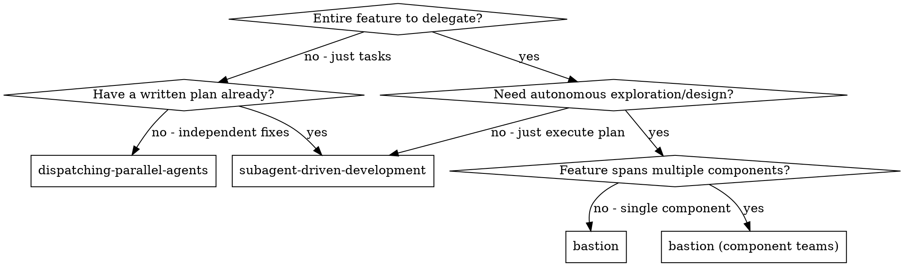
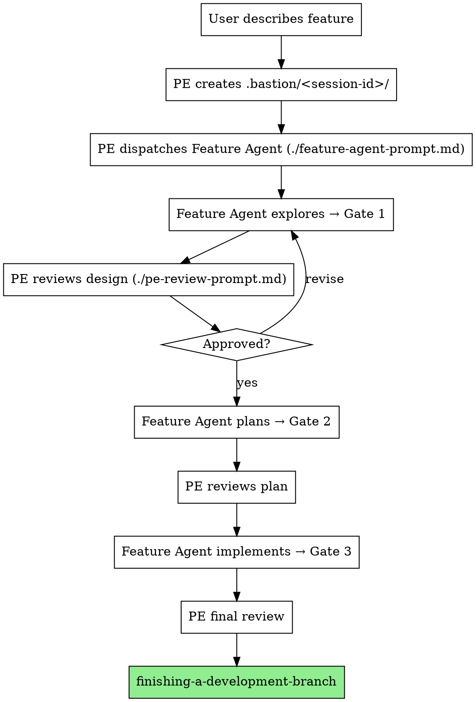
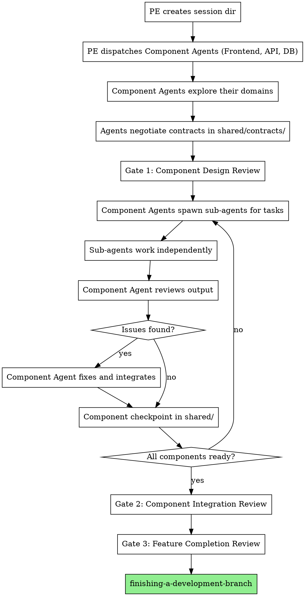

# Bastion — Autonomous Feature Agent Orchestration

Delegate entire features to autonomous Feature Agents. Principal Engineer (PE) controller validates at milestone gates. File-based memory in `.bastion/<session-id>/` enables resumption and handoff.

**Core principle:** Session-based orchestration + autonomous agent per feature + milestone gates + hierarchical validation + file-based state = high-quality features with minimal PE overhead.

**Announce at start:** "I'm using the Bastion skill to orchestrate this feature."

## When to Use



**Use when:**
- Delegating a complete feature (not a single task)
- Feature Agent should explore codebase, design approach, plan, implement
- PE validates at milestone gates rather than controlling every step
- Need file-based memory for resumption/handoff
- **Component Teams mode:** Feature spans multiple layers (frontend + backend + database) requiring coordination

**Don't use when:**
- You already have a written plan (use `subagent-driven-development`)
- Tasks are independent fixes (use `dispatching-parallel-agents`)
- Single small task (just do it directly)
- Need pure peer-to-peer research without PE gates (use agent teams)

**Component Teams vs Agent Teams:**

Both use multiple agents, but differ in structure and purpose:

| | **Bastion Component Teams** | **Agent Teams** |
|:---|:---|:---|
| **Scope** | One feature, multiple components | Multiple related investigations or approaches |
| **Structure** | Hierarchical: PE → Component Agents → Sub-agents | Peer-to-peer: teammates coordinate equally |
| **Agent relationship** | Component agents divide work, each owns their domain | Teammates may work on same area, challenge each other |
| **Sub-agents** | Yes - component agents spawn sub-agents for tasks | No - all agents are peers |
| **Quality gates** | Component agents review sub-agent work; PE reviews components | No formal gates, self-coordinating |
| **Best for** | Multi-layer feature implementation | Research, exploration, competing hypotheses |

**Choose bastion component teams when:** Building a feature that spans frontend/backend/database with clear component boundaries and sub-agent delegation.

**Choose agent teams when:** Exploring a problem space where you want multiple independent investigators who challenge each other's findings.

### Comparison with Agent Teams

All three approaches orchestrate multiple Claude instances but differ in structure, hierarchy, and communication:

| | **Bastion (Single Agent)** | **Bastion Component Teams** | **Agent Teams** |
|:---|:---|:---|:---|
| **Scope** | One feature, one component | One feature, multiple components | Multiple investigations or approaches |
| **Hierarchy** | PE → Feature Agent | PE → Component Agents → Sub-agents | Flat - teammates are peers |
| **Sub-agents** | No | Yes - for task delegation | No |
| **Communication** | Upward only | Component coordination + PE gates | Peer-to-peer bidirectional |
| **Quality gates** | PE validates at gates | Component agents validate sub-agents; PE validates components | Self-coordinating, no formal gates |
| **Best for** | Single-component features | Multi-layer features (UI + API + DB) | Research, exploration, competing hypotheses |
| **Token cost** | Low (1 context) | Moderate (multiple contexts) | High (many independent contexts) |
| **State** | `.bastion/<session>/<feature>/` | `.bastion/<session>/<feature>/<component>/` | `~/.claude/teams/` |

**Decision guide:**
- **Single component feature** → Bastion single agent
- **Multi-component feature with clear boundaries** → Bastion component teams
- **Research/exploration with competing approaches** → Agent teams

## Roles & Hierarchy

Three-tier structure for complex features:

```
PE (Principal Engineer)
  └── Feature Agents (divide feature across components)
        └── Sub-agents (mundane tasks, research, drafting)
```

| Role | Who | Does |
|------|-----|------|
| **PE** | Controller agent (you) | Dispatch, validate gates at feature level, course-correct |
| **Feature Agent** | Persistent subagent (`task_id`) | Own component of feature, delegate to sub-agents, review/fix their work, consolidate for PE |
| **Sub-agent** | Temporary task agent | Execute mundane tasks, research, drafting, coding sub-tasks |
| **Human** | User | Define features, override PE when needed |

**Key Principle:** Feature Agents are responsible for sub-agent output quality. They review, fix, and validate all sub-agent work before presenting to PE. PE gates happen at the feature level, not sub-task level.

## State Management

Feature Agents maintain persistent memory via `.bastion/<session-id>/` directory tree:

```
.bastion/
  <session-id>/                 # Unique per invocation (e.g., 2026-02-10-feature-auth-001)
    session.md                  # Session metadata: purpose, agents, status
    
    <feature-slug>/             # Single feature with multiple components
      feature-brief.md          # Overall feature description, acceptance criteria
      
      <component-agent>/        # e.g., "frontend-agent", "api-agent", "db-agent"
        agent-card.md           # Component scope, constraints, configured gates
        state.md                # Current phase, status, blockers
        
        exploration/
          codebase-map.md       # Component-specific files and architecture
          dependencies.md       # What this component touches
          gotchas.md            # Surprising findings, edge cases
        
        design/
          approach.md           # Chosen approach + alternatives
          decisions.md          # Key decisions and rationale
        
        plan/
          implementation.md     # Component task plan
        
        implementation/
          progress.md           # Task-by-task status
          debugging-log.md      # Issues and resolutions
          takeaways.md          # Lessons learned
          
          sub-agents/           # Sub-agent workspaces
            <subtask-id>/
              task-brief.md     # What sub-agent was asked to do
              output/           # Sub-agent's raw output
              reviewed/         # Feature Agent's reviewed/fixed version
              notes.md          # Review notes, what was fixed
        
        handoff/
          faq.md                # Component-specific Q&A
          gotchas.md            # Warnings for PE
          context.md            # Component state dump
          consolidation.md      # How sub-agent work was integrated
    
    shared/                     # Collaborative mode only
      coordination/
        messages/               # Component agent communication
        announcements/
        dependencies.md         # Cross-component dependencies
        alignment-checkpoints/
```

**Component-Based Organization:** Each Feature Agent owns a component (frontend, backend, database, etc.) of the same feature. They work in parallel and coordinate through `shared/` directory.

**Sub-Agent Pattern:** When a Feature Agent needs work done:
1. Creates `sub-agents/<subtask-id>/` directory
2. Spawns sub-agent with task brief
3. Sub-agent writes to `output/`
4. **Feature Agent reviews output, fixes issues, validates**
5. Stores reviewed version in `reviewed/`
6. Documents fixes in `notes.md`
7. Integrates into component implementation
8. Only then reports to PE at gate

**PE sees:** Consolidated, validated component work. Never raw sub-agent output.

**Session Naming Convention:**
- Format: `<YYYY-MM-DD>-<brief-description>-<counter>`
- Examples: `2026-02-10-auth-refactor-001`, `2026-02-10-api-redesign-002`
- Auto-generated by PE at skill invocation, or user-specified

**Handoff protocol:** At every gate, Feature Agent writes `context.md`, `gotchas.md`, `faq.md`, and `debugging-log.md`. If session dies, a fresh agent reads `.bastion/<session-id>/<feature>/` and resumes.

**Session Isolation:** Each invocation creates an isolated workspace. Sessions don't share state—every orchestration starts fresh with its own directory structure.

## Session Lifecycle

### Creating a Session

When you invoke the Bastion skill, the PE creates a unique session:

1. **Generate session ID**: `<YYYY-MM-DD>-<description>-<counter>` (e.g., `2026-02-10-api-redesign-001`)
2. **Create directory structure**: `.bastion/<session-id>/` with all subdirectories
3. **Initialize session.md**: Record session purpose, assigned agents, and status
4. **Dispatch Feature Agents**: Create agent subdirectories and spawn agents

### Session Metadata (session.md)

```yaml
---
session_id: 2026-02-10-api-redesign-001
created: 2026-02-10T14:30:00Z
purpose: Refactor authentication API with OAuth2 support
status: active  # active | paused | completed | aborted
pe: <agent-id>
features:
  - feature-a: oauth2-endpoints
  - feature-b: token-refresh
  - feature-c: auth-middleware
collaborative_mode: true
current_gate: 2
---

## Session Log
- [2026-02-10T14:30:00Z] Session created
- [2026-02-10T14:35:00Z] Feature agents dispatched
- [2026-02-10T16:00:00Z] Gate 1 approved - design phase complete
```

### Listing Active Sessions

```bash
ls -la .bastion/
# Shows: 2026-02-10-feature-auth-001/  2026-02-10-api-redesign-002/  ...
```

### Session Cleanup

When a session completes (all features done or aborted):

```bash
# Archive completed session
mv .bastion/2026-02-10-feature-auth-001 .bastion/archive/

# Or delete if no longer needed
rm -rf .bastion/2026-02-10-feature-auth-001
```

**Important:** Never delete active sessions—agents lose their persistent memory and cannot resume.

## Lifecycle & Gates

### Default (3 gates)

```
Dispatch → [Explore] → GATE 1: Design Review → [Plan] → GATE 2: Plan Review → [Implement] → GATE 3: Completion Review → Done
```

### Phases

| Phase | Agent Does | Writes To | Uses Skill |
|-------|-----------|-----------|------------|
| **Explore** | Read codebase, map dependencies | `exploration/` | — |
| **Design** | Propose approach, consider alternatives | `design/` | — |
| **Plan** | Create bite-sized TDD task plan | `plan/` | `writing-plans` |
| **Implement** | Execute tasks, test, commit, log | `implementation/` | `test-driven-development` |
| **Complete** | Self-review, write handoff, verify | `handoff/` | — |

### Gate Behavior

At each gate, Feature Agent:
1. Updates `state.md` with current phase/status
2. Writes all phase artifacts
3. Returns structured milestone report to PE
4. **Pauses** — waits for PE verdict

**Quality Gates:** Consider implementing automated hooks that run before gate completion:
- Pre-gate validation scripts to check for TODO/FIXME markers
- Test execution verification
- Lint/type-check enforcement

These hooks can prevent agents from submitting incomplete work, similar to agent teams' `TeammateIdle` and `TaskCompleted` hooks.

### PE Verdicts

- **Approve** — resume next phase (use `./gate-resume-prompt.md`)
- **Revise** — provide feedback, agent revises and re-gates (use `./gate-revise-prompt.md`)
- **Redirect** — change scope/approach, agent adjusts
- **Abort** — feature abandoned, cleanup

### Configurable Gates

Gates are configurable per feature. Add mid-implementation checks:

```
"Add a gate after implementation task 3"
```

## Hierarchical Validation

Three-tier validation chain. Every level requires validation before advancing. No exceptions.

```
Feature (PE validates at gates)
  ├── Gate 1: Design (PE validates)
  ├── Gate 2: Plan (PE validates)
  │
  ├── Component: Frontend (Feature Agent validates)
  │     ├── Sub-agent: icon-set → output/ → Feature Agent reviews → reviewed/
  │     ├── Sub-agent: form-validation → output/ → Feature Agent reviews → reviewed/
  │     ├── Task 1 (integrated from sub-agent + own work)
  │     │     ├── Write failing test → Verify: fails
  │     │     ├── Implement → Verify: passes
  │     │     ├── Commit
  │     │     └── ✓ Task validation: tests pass, committed
  │     ├── Task 2 → ✓ Task validation
  │     └── Component checkpoint → alignment update
  │
  ├── Component: API (Feature Agent validates)
  │     ├── Sub-agent: endpoint-scaffold → reviewed by Feature Agent
  │     ├── Task 1-N → ✓ Task validation
  │     └── Component checkpoint
  │
  ├── Gate 3 (optional): Mid-implementation (PE validates)
  │
  ├── Component: Database (Feature Agent validates)
  │     └── Tasks...
  │
  └── Gate 4: Completion (PE validates all components consolidated)
```

| Level | Validated By | On Failure |
|-------|-------------|------------|
| **Sub-agent output** | Feature Agent (mandatory review) | Fix in `reviewed/`, document in `notes.md` |
| **Task** | Feature Agent | Log to debugging-log, fix |
| **Component** | Feature Agent (self-review + consolidation) | Fix before presenting to PE |
| **Gate** | PE | Revise/Redirect/Abort |
| **Feature** | PE | Revise or Accept |

**Iron rules:**
- No task moves to "complete" without documented, executed validation
- No sub-agent output reaches PE without Feature Agent review
- No component work reaches PE without consolidation documentation
- PE validates at the feature level, not the sub-agent level

## Gate Review Process (PE)

Use `./pe-review-prompt.md` at each gate. Key checks:

### Implementation Reality Check

1. **No mocks/stubs as final code** — scan for `TODO`, `FIXME`, `not implemented`, hardcoded returns, `// placeholder`
2. **Test quality** — tests exercise real code, would fail if wrong, no `.skip`/`xit`/`pending`
3. **Completeness** — every acceptance criterion has code, edge cases handled, errors handled

### Anti-Pattern Scan

```bash
# Run at each gate
grep -rn "TODO\|FIXME\|stub\|placeholder\|not implemented" <changed-files>
grep -rn "\.skip\|xit\|test\.only\|@Ignore\|pending" <test-files>
```

### Structured Revision Feedback

```markdown
## Gate Review: REVISE
### Issues Found
1. `file:line` — description
### Required Changes
- Specific fix required
### Re-gate When
All issues resolved, tests pass, no new stubs
```

### Contract Verification (Component Teams)

At each gate, PE verifies implementations match agreed interfaces:

1. **Read all contracts** in `shared/coordination/contracts/`
2. **For each contract, verify:**
   - API endpoints: routes, methods, request/response shapes match
   - Data models: field names, types, nullability match across components
   - Shared types: both sides use the same definitions
3. **Check for unilateral changes:** any `breaking-change` announcements without corresponding contract updates?
4. **Verify dependency resolution:** all items in `dependencies.md` are either resolved or have a clear plan

```bash
# Example: Verify API contract matches implementation
# If contract says POST /api/auth/login { email: string, password: string }
grep -rn "/auth/login\|/api/auth" <api-source-files>
# Check response shape matches what frontend expects
grep -rn "login.*response\|LoginResponse" <frontend-source-files> <api-source-files>
```

**If contract mismatch found:** REVISE — require the components to align. Either update the implementation or update the contract with agreement from all affected components.

## PE Workflow

### Handling SOS Escalations

Feature Agents can send unscheduled SOS reports when blocked (not just at gates). When a PE receives an SOS:

1. **Read the SOS report** — understand the blocker, what was tried, and options proposed
2. **Check state files** — read `state.md` and relevant artifacts to verify the agent's assessment
3. **Decide:**
   - **Unblock** — provide the missing information, decision, or direction
   - **Redirect** — change the approach if the agent's path is a dead end
   - **Coordinate** — if one component blocks another, mediate between agents
   - **Escalate to human** — if the blocker requires human decision (scope change, resource, etc.)
4. **Resume the agent** with clear instructions using the same `task_id`

**SOS is NOT a gate.** The agent doesn't need to re-submit a formal gate report after an SOS. It continues working after receiving PE guidance and reports at the next scheduled gate.

### Sequential Mode (default)



### Concurrent Mode

Dispatch multiple Feature Agents within a single session directory (`.bastion/<session-id>/`). PE reviews gates as they come in. Check for cross-feature file conflicts at each gate.

<Warning>
  **Token Cost:** Running multiple Feature Agents concurrently significantly increases token usage. Each agent maintains its own context window. Use concurrent mode only when parallel work adds real value, not for routine tasks.
</Warning>

**Task Coordination:** When running concurrent agents, use file-based locking patterns to prevent race conditions if agents claim overlapping work. Each agent should:
1. Write a `claim.lock` file atomically in their feature directory before starting work on a task
2. Check for existing locks across all feature directories before modifying shared files
3. Clean up locks on completion or failure

### Collaborative Mode (Component Teams)

When one feature spans multiple components (frontend, backend, database, etc.), divide work across component agents who coordinate on the same feature.

```
PE (Lead)
  └── Feature: "User Authentication Refactor"
        ├── Frontend Agent → `.bastion/<session-id>/auth-refactor/frontend-agent/`
        │       ↕ (reads/writes shared memory)
        │       └── Sub-agents for UI components, form validation, etc.
        ├── API Agent → `.bastion/<session-id>/auth-refactor/api-agent/`
        │       ↕ (reads/writes shared memory)
        │       └── Sub-agents for endpoint implementation, middleware, etc.
        └── Database Agent → `.bastion/<session-id>/auth-refactor/db-agent/`
                ↕ (reads/writes shared memory)
                └── Sub-agents for schema changes, migrations, etc.
                          ↓
                `.bastion/<session-id>/auth-refactor/shared/`
```

**When to use:**
- Single feature touching multiple layers (UI, API, database, tests)
- Components have dependencies requiring coordination
- Work can be parallelized across the stack
- Cross-cutting concerns need alignment

**Component Agent Responsibilities:**

Each component agent:
1. **Owns their component** from exploration through implementation
2. **Spawns sub-agents** for discrete tasks (research, drafting, coding sub-tasks)
3. **Reviews and fixes** all sub-agent output before integration
4. **Coordinates with other components** through shared memory
5. **Presents consolidated work** to PE at gates

**Sub-Agent Workflow:**

```
Feature Agent identifies task → Spawns sub-agent
        ↓
Sub-agent works independently → Writes to output/
        ↓
Feature Agent reviews output
        ↓
┌─────────────────────────────────────┐
│ Quality checks:                     │
│ • Does it meet requirements?        │
│ • Are there bugs or issues?         │
│ • Does it follow patterns?          │
│ • Are edge cases handled?           │
└─────────────────────────────────────┘
        ↓
Feature Agent fixes issues → Stores in reviewed/
        ↓
Documents what was fixed in notes.md
        ↓
Integrates into component implementation
        ↓
Continues to next task or reports to PE at gate
```

**Critical:** PE never sees raw sub-agent output. Feature Agents are quality gates for their subordinates.

## Sub-Agent Management

When Feature Agents need to delegate discrete tasks, they spawn sub-agents with specific assignments.

### When to Spawn Sub-Agents

**Good sub-agent tasks:**
- Research a specific library or API
- Draft initial implementation of a helper function
- Generate test cases for a component
- Write documentation for a feature
- Investigate a specific bug or issue
- Refactor a self-contained module

**Don't spawn sub-agents for:**
- Critical architectural decisions (Feature Agent should own these)
- Cross-component coordination (requires Feature Agent judgment)
- PE gate preparation (Feature Agent must synthesize and validate)
- Complex debugging requiring full context (Feature Agent has better context)

### Sub-Agent Lifecycle

```
1. Feature Agent identifies task
   ↓
2. Creates workspace: implementation/sub-agents/<subtask-id>/
   ├─ task-brief.md (detailed requirements)
   ├─ context/ (relevant files/code)
   └─ constraints.md (patterns to follow, pitfalls to avoid)
   ↓
3. Spawns sub-agent with task brief
   ↓
4. Sub-agent works independently, writes to output/
   ↓
5. Feature Agent reviews output/
   ├─ Quality check: Does it meet requirements?
   ├─ Pattern check: Does it follow project conventions?
   ├─ Edge case check: Are boundary conditions handled?
   └─ Integration check: Will it work with existing code?
   ↓
6. If issues found:
   ├─ Document issues in notes.md
   ├─ Fix in reviewed/ directory
   └─ May spawn another sub-agent for fixes if needed
   ↓
7. If acceptable:
   ├─ Copy to reviewed/ (even if unchanged)
   └─ Document "no changes needed" in notes.md
   ↓
8. Feature Agent integrates reviewed/ work into component
   ↓
9. Updates progress.md and continues
```

### Sub-Agent Task Brief Template

```markdown
# Task Brief: <Subtask ID>

## Objective
Clear, specific description of what to accomplish.

## Context
- Relevant files: [list files in context/]
- Related code: [specific functions/classes]
- Constraints: [from constraints.md]

## Requirements
1. Must do X
2. Must handle Y edge case
3. Must follow Z pattern

## Output
Write to: output/<filename>
Format: [code, markdown, test cases, etc.]

## Definition of Done
- [ ] All requirements met
- [ ] Tests pass (if applicable)
- [ ] Follows project patterns
- [ ] No TODO/FIXME markers

## Timebox
Maximum: 30 minutes. If not done, write progress to output/ and stop.
```

### Review Checklist

Before integrating sub-agent work, Feature Agent MUST verify:

- [ ] **Completeness:** All requirements from task-brief.md addressed
- [ ] **Correctness:** Logic is sound and handles edge cases
- [ ] **Patterns:** Follows project conventions and existing patterns
- [ ] **Quality:** No obvious bugs, security issues, or performance problems
- [ ] **Integration:** Will work correctly with existing code
- [ ] **Tests:** If task includes tests, they actually test the right thing
- [ ] **Cleanup:** No debug code, console.logs, or temporary files

### Handling Sub-Agent Failures

**If sub-agent produces poor quality:**
1. Document specific issues in `notes.md`
2. Fix issues in `reviewed/` OR spawn new sub-agent with clearer instructions
3. Update `task-brief.md` with additional context/constraints
4. If pattern of failures, Feature Agent should do the work directly

**If sub-agent is stuck:**
1. Review their partial output in `output/`
2. Provide guidance or break task into smaller pieces
3. May take over and complete the task

**If sub-agent exceeds timebox:**
1. Review partial work
2. Decide: continue, revise scope, or integrate what's done
3. Document decision in `notes.md`

**Shared Memory Structure:**

```
.bastion/<session-id>/<feature-slug>/
  shared/
    coordination/
      messages/              # Component-to-component messages
        <timestamp>-<from>-<to>.md
      announcements/         # Broadcasts to all components
        <timestamp>-<from>.md
      dependencies.md        # Cross-component dependencies
        # Example:
        # - Frontend depends on API: /auth/login endpoint
        # - API depends on Database: users table schema
      alignment-checkpoints/ # Component status updates
        <component>-<timestamp>.md
      contracts/             # Interface agreements between components
        api-contract.md
        data-models.md
  
  frontend-agent/
    # ... component structure
    subscriptions.md         # Which components to monitor (e.g., "api-agent")
  
  api-agent/
    # ... component structure
    subscriptions.md
```

**Communication Patterns:**

1. **Direct Message:** Component A writes to `shared/coordination/messages/`, Component B polls and responds
2. **Broadcast:** Component posts to `shared/coordination/announcements/` for all components
3. **Alignment Checkpoint:** Components write status showing progress and blockers
4. **Dependency Tracking:** `dependencies.md` lists cross-component dependencies and blocking status
5. **Contracts:** Components agree on interfaces in `contracts/` before implementation

**Message Schema:**

All messages MUST use this structured format so agents can reliably parse them:

```markdown
---
from: frontend-agent
to: api-agent          # omit for broadcasts
type: question | info | request | dependency-update | breaking-change | progress
priority: normal | urgent
needs_response: true | false
timestamp: 2026-02-10T15:30:00Z
---

## Subject
[One-line summary of what this message is about]

## Body
[Detailed content — be specific and actionable]

## Action Required
[What the recipient should DO — or "None, informational only"]

## Deadline
[When you need a response by — or "None"]
```

**Announcement Schema:**

```markdown
---
from: api-agent
type: breaking-change | progress | interface-update | heads-up
timestamp: 2026-02-10T15:30:00Z
affects: [frontend-agent, db-agent]   # which components are impacted
---

## Subject
[One-line summary]

## Details
[What changed and why]

## Impact
[What other components need to do in response — be specific]
```

**Why structured schema matters:** Without it, agents write free-form prose that other agents can't reliably act on. The `type`, `needs_response`, and `Action Required` fields ensure messages are actionable, not just informational.

**PE Role in Collaborative Mode:**
- Validates at feature-level gates (not component or sub-agent level)
- Reviews consolidated component work from each Feature Agent
- Can read shared memory to understand cross-component alignment
- May add coordination checkpoints between components
- Resolves conflicts if component agents disagree on interfaces

**Component Agent Coordination Rules:**
- **Poll before acting:** Check `messages/` and `announcements/` before making cross-component decisions
- **Write checkpoints:** Update `alignment-checkpoints/` after significant progress
- **Update dependencies:** Modify `dependencies.md` when relationships change
- **Negotiate contracts:** Agree on interfaces in `contracts/` before coding
- **Handle breaking changes:** Notify other components via announcements before changing shared interfaces

**Polling Cadence — When to Check Coordination:**

Agents MUST poll `shared/coordination/` at these specific points:

| When | What to Check | Why |
|------|---------------|-----|
| **Starting a new phase** | All messages + announcements | Catch decisions made while you were in a previous phase |
| **Before cross-component work** | Messages to you + contracts | Ensure interface hasn't changed |
| **After completing each task** | Messages (quick scan) | Respond to urgent requests promptly |
| **Before writing to contracts/** | All existing contracts + announcements | Don't overwrite someone else's proposal |
| **Before gate submission** | All coordination files | Ensure nothing invalidates your work |
| **After PE resumes you from a gate** | Everything | Other components may have progressed during your gate pause |

**Do NOT poll:**
- In the middle of writing a single file (breaks flow)
- Between every line of code (wasteful)
- More than once per task (unless task takes >15 min)

**Responding to messages:**
- `needs_response: true` + `priority: urgent` → respond before your next task
- `needs_response: true` + `priority: normal` → respond before your next checkpoint
- `needs_response: false` → acknowledge only if it affects your work

### Resumption

If session dies: new agent reads `.bastion/<session-id>/<feature>/state.md` + all artifacts + `handoff/context.md` → picks up where left off. The session directory preserves complete state for all features in that orchestration.

### Error Recovery & Triage Protocol

When resuming a dead session, the fresh agent MUST follow this triage protocol before doing any work:

**Step 1: Assess session state**
```
Read .bastion/<session-id>/session.md          → What was the session doing?
Read .bastion/<session-id>/<feature>/state.md  → What phase was the agent in?
```

**Step 2: Check for half-written work**
```
Check implementation/progress.md → Which tasks are marked "in-progress" vs "complete"?
Check for uncommitted changes   → git status / git diff
Check for partial files          → Files that look truncated or have incomplete code
```

**Step 3: Triage decision tree**

| State Found | Action |
|-------------|--------|
| Clean gate boundary (state.md says `gate-N-waiting`) | Resume from that gate — work is complete up to here |
| Mid-task (progress.md shows task in-progress) | Read the task's validation criteria. Run tests. If they pass, mark complete. If not, redo the task from scratch |
| Uncommitted changes exist | Review changes carefully. If they look complete and tests pass, commit. If partial, revert and redo |
| Partial/truncated files | Delete and redo — never try to complete someone else's half-written code |
| Sub-agent output/ exists but no reviewed/ | Treat as unreviewed — Feature Agent must review before integrating |
| state.md says BLOCKED | Read the blocker description. If you can resolve it, proceed. If not, SOS to PE |

**Step 4: Write recovery notes**
```
Append to state.md:
  ## Recovery: [TIMESTAMP]
  - Previous agent died at: [phase/task]
  - State found: [clean/partial/broken]
  - Action taken: [resumed/reverted/redid]
  - Discarded work: [list anything thrown away and why]
```

**Step 5: Resume normal operation**

Continue from the recovered state. Do NOT skip validation for any work you inherited — even if the previous agent marked it complete, verify it yourself.

**Critical:** Never trust the previous agent's claims without verification. Run tests, check files, verify commits. The previous agent may have crashed mid-write.

### Collaborative Mode Workflow (Component Teams)



**Key differences from sequential:**
1. **Component specialization:** Each agent owns a layer (frontend, API, database)
2. **Sub-agent delegation:** Component agents spawn sub-agents for tasks and review their work
3. **Contract-first:** Components agree on interfaces before implementation
4. **Checkpoint coordination:** Regular updates via shared memory to stay aligned
5. **Quality gates:** Feature Agents validate sub-agent work; PE validates component integration

## Prompt Templates

- `./feature-agent-prompt.md` — Dispatch Feature Agent
- `./gate-resume-prompt.md` — Resume after PE approval
- `./gate-revise-prompt.md` — Resume with revision feedback
- `./pe-review-prompt.md` — PE gate review checklist

## Red Flags

**Feature Agent must NEVER:**
- Skip writing to `.bastion/` state files
- Mark task complete without executed validation
- Use mocks/stubs as final implementation
- Proceed past gate without PE approval
- Delete previous state files (append, don't destroy)
- Implement outside agreed scope
- **Present raw sub-agent output to PE** (must review and fix first)
- **Skip sub-agent review checklist** (must verify quality before integration)
- **Spawn sub-agents for critical decisions** (must own architecture and gates)

**PE must NEVER:**
- Auto-approve gates without reading artifacts
- Skip anti-stub scan
- Let Feature Agent run unbounded without gates
- Approve work with TODO/FIXME markers
- Trust agent's test report without running tests independently

**If Feature Agent asks questions:** Answer completely before letting it proceed.
**If gate review finds issues:** Revise → fix → re-gate. Never skip re-review.
**If session dies:** Fresh agent reads `.bastion/<session-id>/` directory. Full context preserved for that session.

### Context Management

Feature Agents (like agent team teammates) load project context automatically:
- **CLAUDE.md** files from working directory
- **MCP servers** configured in the project
- **Skills** available to the session

**Important:** Feature Agents do NOT inherit the PE's conversation history. Include all task-specific context in the dispatch prompt.

## End-to-End Example: OAuth2 Login Feature

This example shows a complete session from dispatch to completion using Component Teams mode.

### 1. PE Creates Session

User says: "Add OAuth2 login with Google. Need frontend login button, API endpoints, and database schema."

PE creates the session:

```
.bastion/2026-02-10-oauth2-login-001/
  session.md
  oauth2-login/
    feature-brief.md
    frontend-agent/
    api-agent/
    db-agent/
    shared/
      coordination/
        messages/
        announcements/
        dependencies.md
        alignment-checkpoints/
        contracts/
```

`session.md`:
```yaml
---
session_id: 2026-02-10-oauth2-login-001
created: 2026-02-10T14:00:00Z
purpose: Add OAuth2 login with Google provider
status: active
collaborative_mode: true
---
```

### 2. PE Dispatches Component Agents

PE dispatches three agents using `./feature-agent-prompt.md` (Variant B):
- **frontend-agent** — Login button, OAuth redirect, token storage
- **api-agent** — `/auth/google`, `/auth/callback`, token validation
- **db-agent** — Users table, sessions table, migrations

Each gets their component scope, acceptance criteria, and awareness of teammates.

### 3. Agents Explore (Phase 1)

Each agent explores their domain independently:
- `frontend-agent` maps the existing auth UI, finds `src/components/Login.tsx`
- `api-agent` finds existing auth middleware in `src/middleware/auth.ts`
- `db-agent` maps the existing schema, finds the users table needs a `provider` column

### 4. Agents Negotiate Contracts

Before Gate 1, agents write contracts:

`shared/coordination/contracts/api-contract.md`:
```markdown
## OAuth2 API Contract

### POST /auth/google
Response: { redirectUrl: string }

### GET /auth/google/callback?code=...
Response: { token: string, user: { id: string, email: string, name: string } }

### GET /auth/me (existing, updated)
Response: { id: string, email: string, name: string, provider: "local" | "google" }
```

`shared/coordination/contracts/data-models.md`:
```markdown
## Users Table Changes
- Add column: provider VARCHAR(20) DEFAULT 'local'
- Add column: provider_id VARCHAR(255) NULLABLE
- Add unique index: (provider, provider_id)

## Sessions Table (existing, no changes)
```

### 5. Gate 1: Design Review

Each agent returns a gate report. PE reviews using `./pe-review-prompt.md`:
- Reads all three `design/approach.md` files
- Verifies contracts are consistent across components
- Checks that dependencies are tracked

PE approves Gate 1 for all three agents using `./gate-resume-prompt.md`.

### 6. Agents Plan and Implement (Phases 3-4)

**api-agent** spawns a sub-agent for endpoint scaffolding:
```
api-agent/implementation/sub-agents/endpoint-scaffold-01/
  task-brief.md    → "Scaffold the /auth/google and /auth/google/callback routes"
  output/          → Sub-agent writes route files here
  reviewed/        → api-agent reviews, fixes error handling, stores here
  notes.md         → "Fixed: sub-agent used deprecated `res.json()` pattern,
                       switched to project's `sendResponse()` helper"
```

**frontend-agent** sends a message to api-agent:
```
shared/coordination/messages/2026-02-10T16-30-api-to-frontend.md
---
from: api-agent
to: frontend-agent
type: info
priority: normal
needs_response: false
timestamp: 2026-02-10T16:30:00Z
---
## Subject
Callback endpoint ready for testing

## Body
GET /auth/google/callback is implemented and returns the shape from api-contract.md.

## Action Required
None, informational only
```

### 7. SOS Escalation Example

**db-agent** hits a problem — the existing migration tool doesn't support adding indexes concurrently:

```markdown
## SOS: Component Escalation

**Feature:** OAuth2 Login
**Component:** database
**Session:** 2026-02-10-oauth2-login-001

### Blocker
Migration tool (knex) doesn't support CREATE INDEX CONCURRENTLY. Adding
the unique index on (provider, provider_id) will lock the users table.

### What I Tried
1. Knex raw SQL — works but bypasses migration tracking
2. Separate migration file — knex still wraps it in a transaction

### Options
1. Use raw SQL outside knex migration (loses tracking)
2. Accept table lock (users table is small, ~500 rows — lock is <1s)
3. Use a different migration approach for this one migration

### Impact
Blocks db-agent completion. api-agent depends on the index for unique constraint.
```

PE decides: option 2 is fine for 500 rows. Resumes db-agent with that decision.

### 8. Gate 3: Completion Review

PE reviews using `./pe-review-prompt.md`:

1. **Reads all component artifacts** — progress.md, handoff/context.md
2. **Checks sub-agent review chain** — `reviewed/` dirs are populated, `notes.md` documents what was fixed
3. **Runs anti-stub scan** — no TODO/FIXME/placeholder found
4. **Verifies contracts** — API implementation matches `api-contract.md`, frontend calls match
5. **Runs tests independently** — `npm test` passes
6. **Checks consolidation** — each agent's `handoff/consolidation.md` shows how work was integrated

PE approves. Session moves to `finishing-a-development-branch`.

### 9. Final State

```
.bastion/2026-02-10-oauth2-login-001/
  session.md                          # status: completed
  oauth2-login/
    feature-brief.md
    frontend-agent/
      state.md                        # phase: completed
      exploration/                    # codebase-map, dependencies, gotchas
      design/                         # approach, decisions
      plan/                           # implementation plan
      implementation/
        progress.md                   # all tasks: complete
        debugging-log.md              # issues encountered
        sub-agents/
          button-component-01/        # reviewed/
      handoff/
        context.md, faq.md, gotchas.md, consolidation.md
    api-agent/                        # same structure
    db-agent/                         # same structure
    shared/
      coordination/
        contracts/                    # api-contract.md, data-models.md
        messages/                     # 4 messages exchanged
        announcements/                # 1 breaking-change (none in this case)
        dependencies.md               # all resolved
```

## Limitations

Be aware of these constraints when using bastion:

**Session-Based:**
- **Session isolation:** Sessions are completely isolated—no shared state between different `.bastion/<session-id>/` directories
- **Disk usage:** Each session creates a full directory tree; archive or delete completed sessions to manage disk space
- **No cross-session coordination:** Features in different sessions cannot communicate (by design)
- **Session ID collisions:** If you manually create session IDs, ensure uniqueness to prevent data loss

**General:**
- **No automatic task claiming:** Unlike agent teams' file-locking task system, concurrent Feature Agents require manual coordination to avoid conflicts
- **Gate lag:** If a Feature Agent fails to update `state.md` properly, the PE may not recognize gate completion
- **Session resumption:** While `.bastion/<session-id>/` files preserve state, the Feature Agent subagent context is lost if the session dies. Resumption requires spawning a fresh agent
- **One Feature Agent per PE:** A PE should manage one feature at a time per session (unless using concurrent mode). Clean up current feature before starting new delegation
- **Two levels of delegation max:** PE → Feature Agent → Sub-agent. Sub-agents cannot spawn their own sub-agents
- **Permissions inheritance:** Feature Agents start with the PE's permission settings at spawn time

**Component Teams Specific:**
- **Component boundaries:** Requires clear separation of concerns between components (frontend/API/database)
- **Interface contracts:** Components must agree on interfaces before implementation; changes require coordination
- **Sub-agent overhead:** Each component agent may spawn multiple sub-agents, increasing token usage
- **Integration complexity:** Component integration failures require cross-component debugging
- **Quality chain:** If a component agent doesn't properly review sub-agent work, defects reach PE gates
- **Polling-based communication:** Agents must actively check `shared/coordination/` for messages (not real-time push like agent teams)
- **Dependency cycles:** Component agents can create circular dependencies in `dependencies.md`; PE must monitor and break cycles

**Sub-Agent Specific:**
- **Context loss:** Sub-agents don't persist context after task completion; all state must be written to files
- **Quality variance:** Sub-agents may produce inconsistent quality; Feature Agent review is mandatory
- **Task sizing:** Sub-agent tasks must be small enough to complete but substantial enough to be useful
- **Coordination overhead:** Spawning, monitoring, and reviewing sub-agents adds management burden

## Integration

**Feature Agent uses:**
- **superpowers:writing-plans** — Plan phase
- **superpowers:test-driven-development** — Implement phase
- **superpowers:systematic-debugging** — When issues arise
- **superpowers:requesting-code-review** — Reviewing sub-agent output

**Sub-agents use:**
- **superpowers:writing-plans** — If task requires planning
- **superpowers:test-driven-development** — If task involves coding
- **superpowers:systematic-debugging** — If task hits issues
- **superpowers:research** — For investigation tasks
- **superpowers:drafting** — For documentation or content tasks

**Note:** Sub-agents should use appropriate skills for their specific task, then write output to their workspace for Feature Agent review.

**PE uses:**
- **superpowers:verification-before-completion** — Gate reviews (mandatory: run verification before approving any gate)

**On completion:**
- **superpowers:finishing-a-development-branch** — Merge/PR/cleanup

**Coexists with:**
- **superpowers:subagent-driven-development** — For plan-based task execution
- **superpowers:dispatching-parallel-agents** — For independent fixes
- **agent teams** — When peer-to-peer coordination is needed instead of hierarchical delegation
